# 🛒 E-Commerce Application


A full-featured Java-based desktop application using **Swing UI** and **MySQL**, inspired by platforms like **Amazon** and **Flipkart**. It supports a wide range of user and admin functionalities, including order placement, inventory management, cart system, dynamic sales, notifications, and more.

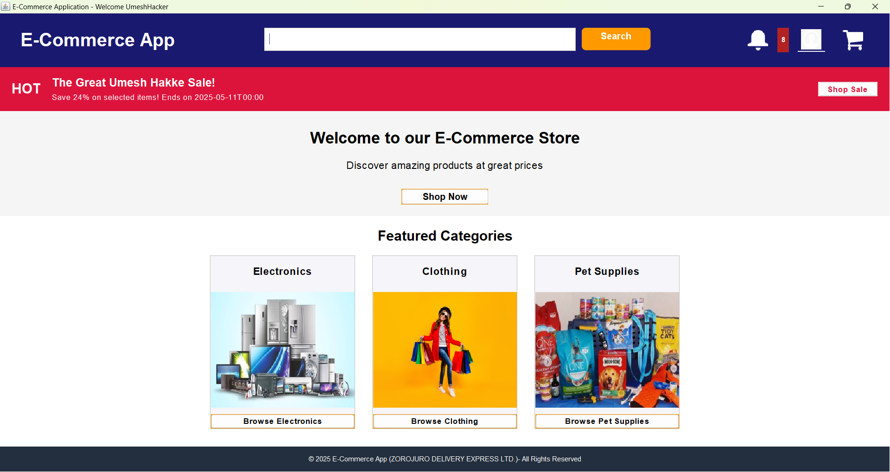

---
## 📌 Project Overview

This system allows customers to browse and purchase products, while admins can manage inventory, view transactions, launch sales, and monitor user activity. The application includes email and PDF receipt generation, order tracking, sale scheduling, and notifications.

---
## 📦 Features

### 🧑‍💼 User Features
- **🔐 User Authentication**: Register, login, and maintain user profiles
- **🛍 Product Browsing**: Browse products with filtering and sorting options
- **🛒 Shopping Cart**: Add products to cart, update quantities, remove items
- **❤️ Wishlist**: Save products for later purchase
- **⭐ Product Reviews**: Rate and review products (1-5 stars)
- **🧾 Checkout Process**: Complete purchases with address selection and payment options
- **🧾 Order History**: View past orders and their status
- **🛎 Notifications**: Receive notifications about orders, sales, and more
- **🧾 Order Receipts**: Download order receipts (PDF)
- **🛎 Order Status**: Track order status (pending → confirmed → shipped → delivered)

### 👨‍💻 Admin Features
- 📦 **Product Management** – Add/edit/delete products with stock and image
- 🗂 **Category Management** – Parent and subcategory structure
- 🛍 **Sales & Discounts** – Create time-limited sales with % discounts
- 📬 **Order Management** – Update order status with auto-tracking
- 📈 **Reports** – Downloadable order receipts in PDF format
- 🔔 **System Notifications** – Alerts for stock or activity

### 🛒 Cart Management
- Add, remove, update quantity
- Auto-calculate discount from active sales
- Checkout functionality

### 🧾 Order & Transaction
- Create orders with automatic delivery estimate (7 days)
- Generate PDF receipt and email it
- UPI or Pay on Delivery support
- Transaction status (Pending, Initiated, Success, Failed, Refunded)

### 🧠 Smart Automation
- 🕒 Scheduled tasks to:
   - Auto-update order statuses
   - Auto-activate/deactivate sales
   - Trigger notifications for users and admins

---

## 🧰 Technical Stack

| Layer        | Technology                      |
|--------------|---------------------------------|
| Language     | Java (24)                       |
| UI           | Java Swing (MVP structured)     |
| DB           | MySQL                           |
| ORM/DB Conn  | JDBC                            |
| PDF Export   | Apache PDFBox                   |
| Email        | JavaMail API (Gmail SMTP)       |
| Scheduler    | Java `ScheduledExecutorService` |
| Build Tool   | Maven                           |

---

## 🧠 Smart Features

- 🕐 **Auto Delivery Tracking** – Status updates based on delivery estimate
- 📧 **Email Confirmation** – Includes attached PDF receipt
- 🗓 **Scheduled Sales & Notifications** – Sales go live & expire automatically
- 📤 **Real-Time Notifications** – For users & admins

---

## 🗃️ Database Tables

| Table          | Description |
|----------------|-------------|
| `users`        | Stores user credentials and roles |
| `products`     | All products with price, stock, image path |
| `categories`   | Hierarchical (parent-child) category list |
| `orders`       | User orders with status and timestamp |
| `order_items`  | Products in each order |
| `transactions` | Order payment info |
| `notifications`| Alerts sent to users |
| `sales`        | Active/inactive discount sales |
| `cart_items`   | Real-time cart for each user |
| `addresses`    | Delivery addresses |

---

## 📸 Screenshots
### 🔐 User Authentication
- **Login Page**

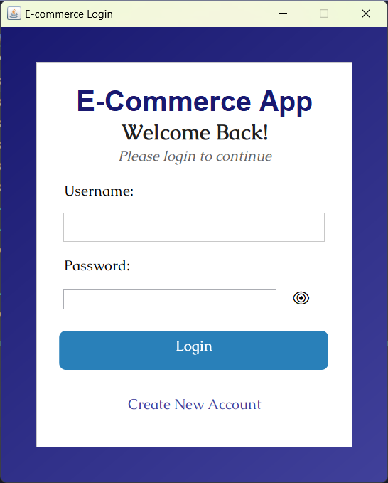
- **Registration Page**
  
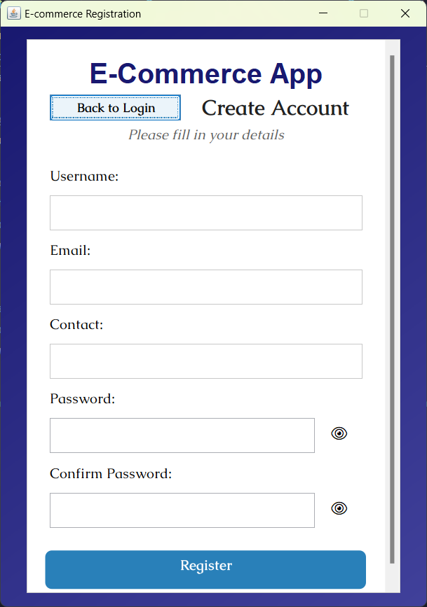
### 🖥 Product Browsing
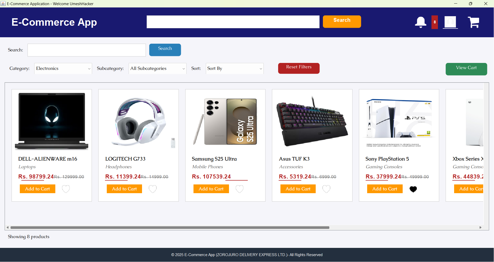

### 🛒 Cart & Checkout
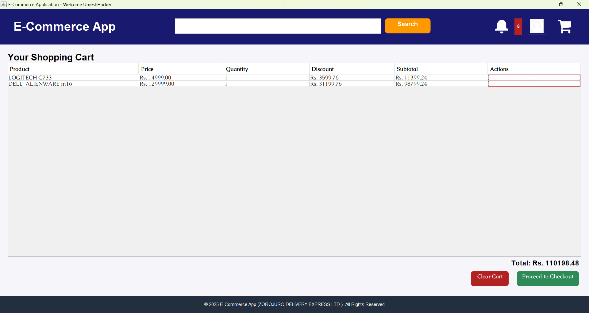

### ❤️ Wishlist
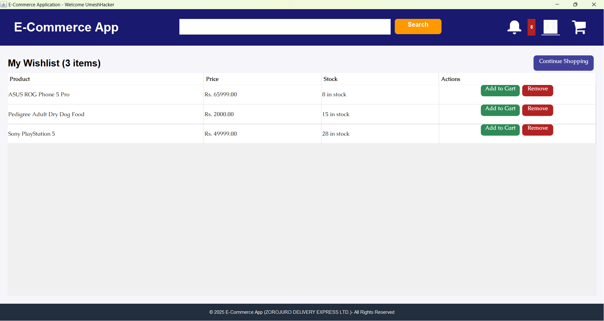

### 🛎 Notifications
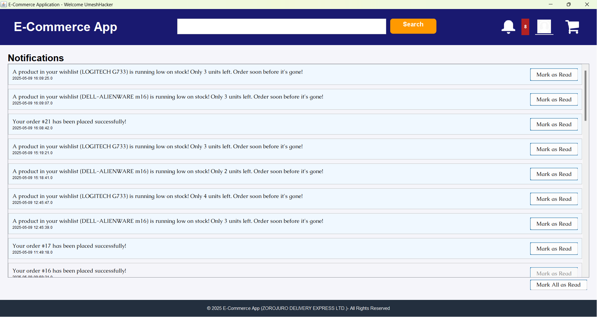

### 📩 Order Receipt PDF
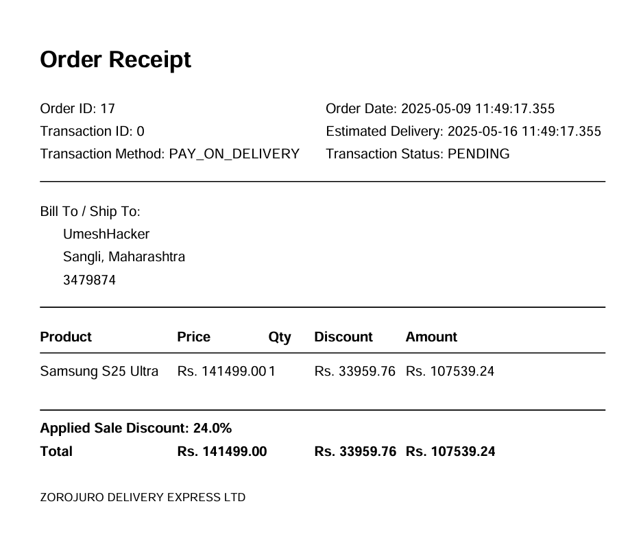

### 📩 Email
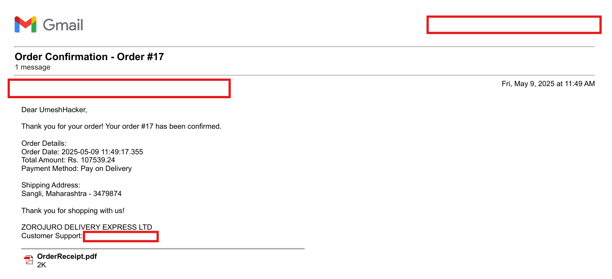

### ⚙️ Admin Product Panel
- **Product Management**


- **Category Management**
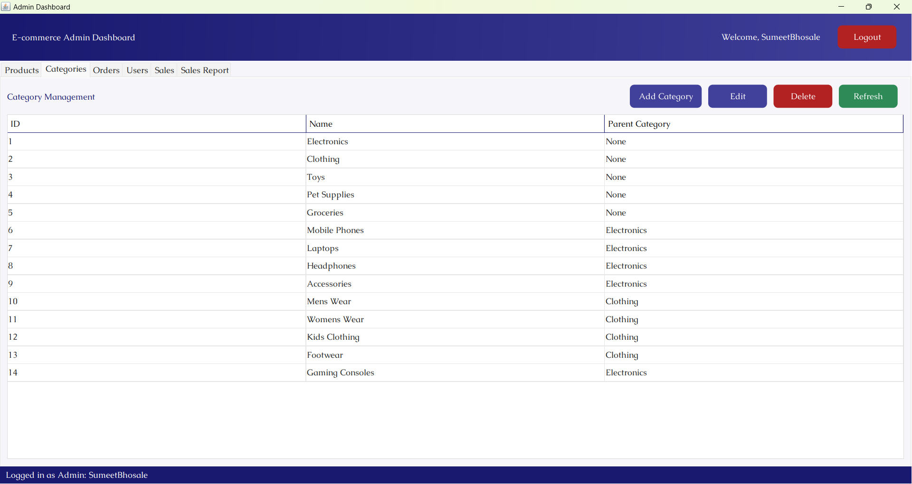

- **Orders**
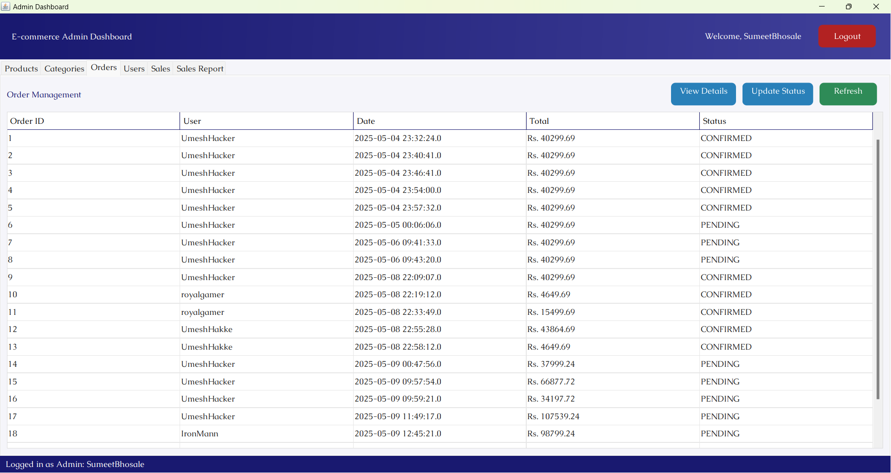

- **Sales Report**
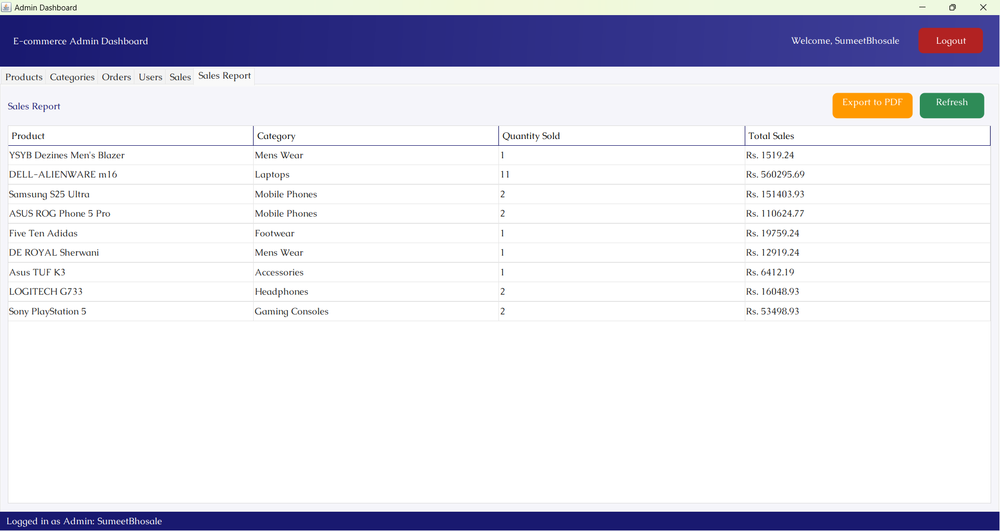

---

## 🧪 Project Structure (Maven)
```
ECommerceApplication/
├── src/
│ ├── main/
│ │ ├── java/
│ │ │ ├── com.ecommerce/
│ │ │ │ ├── config/
│ │ │ │ ├── dao/
│ │ │ │ ├── model/
│ │ │ │ ├── scheduler/
│ │ │ │ ├── service/
│ │ │ │ ├── utils/
│ │ │ │ └── view/
│ │ │ │ └── Main
│ │ └── resources/
│ │ │ │ ├── fonts/
│ │ │ │ ├── icons/
│ │ │ │ ├── images/
│ │ │ │ └── application.properties
├── lib/
├── Products/
├── OrderReceipts/
├── README.md
└── pom.xml
```

---

## ⚙️ Getting Started

### ✅ Prerequisites
- Java 24
- MySQL 5.7+
- Maven
- Gmail App Password (for email feature)

### 📥 Setup Instructions
1. **Clone the repository**
   ```bash
   git clone https://github.com/SumeetBhosale17/ecommerce-application.git
   ```

2. Configure the database
   - Create a MySQL database
   ```sql
   CREATE DATABASE ecommerce_db;
   ```
   - Run the SQL scripts in `src/main/resources/sql/` to set up tables
   
3. Configure application.properties
   ```
   URL=jdbc:mysql://localhost:3306/ecommerce_db?serverTimezone=UTC
   USER=ecom_user
   PASSWORD=ecompass
   mail.username=your_email@gmail.com
   mail.password=your_gmail_app_password
   ```

4. Build the project
   ```
   mvn clean install
   ```

5. Run the application
   ```
   java -jar target/ECommerceApplication-1.0-SNAPSHOT.jar
   ```
---

## 🚀 Future Enhancements
- Role-based admin dashboard GUI
- Payment gateway simulation
- Order return and refund system
- Stock forecast and analytics
- UI Enhancement
- Responsive Web Version (Spring Boot + React)
