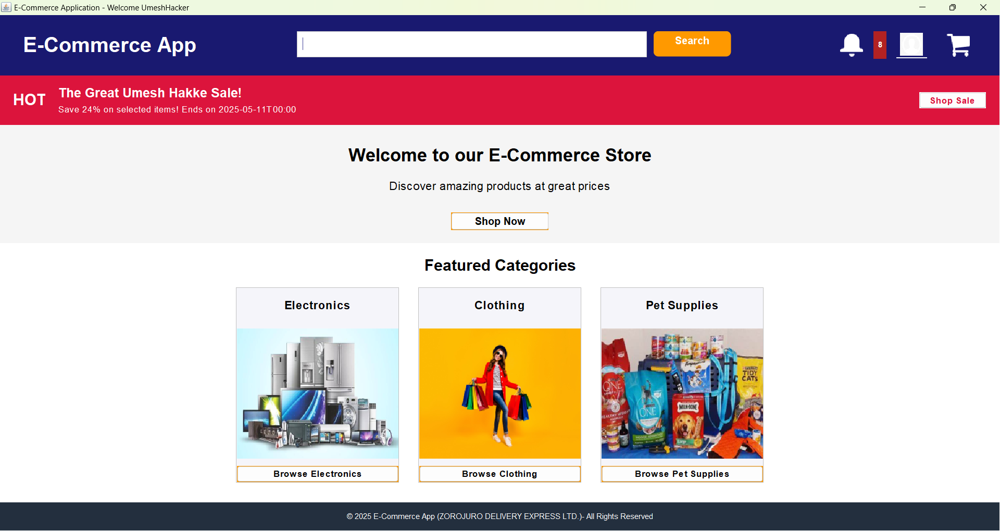

# 🛒 E-Commerce Application


A Java-based desktop e-commerce application built to practice core software engineering principles such as layered architecture, database design, background task scheduling, and end-to-end workflow handling.

This project focuses on system design and logic, not modern UI frameworks.



---
## 📌 Project Overview

This application simultes a real-world e-commerce platform where users can browse products, manage carts, place orders, and track deliveries, while admin manage inventory, sales, and order lifecycles.

It is implemented as a stateful desktop sytem with persistent storage, scheduled background tasks, and role-based workflows.

---

## 🏗 Design & Architecture

This project follows a layered architecture inpired by MVP to keep responsibilities clearly separated.

```scss
UI (Swing Views)
      ↓
Service Layer (Business Logic)
      ↓
DAO Layer (JDBC)
      ↓
MySQL Database
```

### Layers 
- #### View
  Java Swing UI components handling user interaction
- #### Service
  Business rules, validations, order workflows, and state transitions
- #### DAO
  JDBC-based data access for all entities
- #### Model
  Core domain objects (User, Product, Order, Transaction, etc.)

This separation keeps UI logic independent from business rules and database access.

---

## 🔑 Key Engineering Decisions

- #### JDBC instead of ORM
  Chosen to understand low-level SQL interactions, transactions, and schema design.

- #### ScheduledExecutorService for automation
  Used to:

   - Update order delivery status
   - Activate and deactivate time-based sales
   - Trigger system notifications

- #### Desktop-first approach (Swing)
  Avoided web frameworks to focus on backend logic, workflows, and architecture.

- #### PDF & Email integration
  Implemented PDF receipt generation (Apache PDFBox) and email delivery (JavaMail) to simulate real post-order workflows.

---
## 📦 Core Features

### 🧑‍💼 User
- Authentication and profile management
- Product browsing with categories
- Cart, wishlist, and checkout
- Order tracking with delivery states
- PDF receipt download and email confirmation
- System notifications

### 👨‍💻 Admin Features
- Product and category management
- Inventory updates
- Sale and discount scheduling
- Order status management
- Report generation

---

## 🧰 Technical Stack

| Layer        | Technology                      |
|--------------|---------------------------------|
| Language     | Java (24)                       |
| UI           | Java Swing                      |
| DB           | MySQL                           |
| ORM/DB Conn  | JDBC                            |
| PDF Export   | Apache PDFBox                   |
| Email        | JavaMail API (Gmail SMTP)       |
| Scheduler    | Java `ScheduledExecutorService` |
| Build Tool   | Maven                           |

---

## 🗃️ Database Design

Relational schema designed around real-world e-commerce workflows.

| Table          | Description                  |
|----------------|------------------------------|
| `users`        | User accounts and roles      |
| `products`     | Product catalog with stock   |
| `categories`   | Hierarchical categories      |
| `orders`       | Orders with lifecycle status |
| `order_items`  | Items per order              |
| `transactions` | Payment information          |
| `notifications`| System alerts                |
| `sales`        | Time-bound discount sales    |
| `cart_items`   | Active user carts            |
| `addresses`    | Delivery addresses           |

---

## 🧪 Project Structure (Maven)
```
ECommerceApplication/
├── src/
│ ├── main/
│ │ ├── java/
│ │ │ ├── com.ecommerce/
│ │ │ │ ├── config/
│ │ │ │ ├── dao/
│ │ │ │ ├── model/
│ │ │ │ ├── scheduler/
│ │ │ │ ├── service/
│ │ │ │ ├── utils/
│ │ │ │ └── view/
│ │ │ │ └── Main
│ │ └── resources/
│ │ │ │ ├── fonts/
│ │ │ │ ├── icons/
│ │ │ │ ├── images/
│ │ │ │ └── application.properties
├── lib/
├── Products/
├── OrderReceipts/
├── README.md
└── pom.xml
```

---

## 📸 Screenshots

UI screenshots showcasing authentication, product browsing, cart, orders, adming panel, and receipts are available in the `Screenshots/` directory

---

## ⚙️ Getting Started

### ✅ Prerequisites
- Java 24
- MySQL 5.7+
- Maven
- Gmail App Password (for email feature)

### 📥 Setup Instructions
1. **Clone the repository**
   ```bash
   git clone https://github.com/SumeetBhosale17/ecommerce-application.git
   cd ecommerce-application
   ```

2. Configure the database
   - Create a MySQL database
   ```sql
   CREATE DATABASE ecommerce_db;
   ```
   - Run the SQL scripts in `src/main/resources/sql/` to set up tables
   
3. Configure application.properties
Edit `application.properties`:
   ```
   URL=jdbc:mysql://localhost:3306/ecommerce_db?serverTimezone=UTC
   USER=ecom_user
   PASSWORD=ecompass
   mail.username=your_email@gmail.com
   mail.password=your_gmail_app_password
   ```

4. Build the project
   ```
   mvn clean install
   ```

5. Run the application
   ```
   java -jar target/ECommerceApplication-1.0-SNAPSHOT.jar
   ```
---

## 📚 What I Learned

- Designing a multi-layered Java application
- Managing relational data with JDBC
- Handling real-world order workflows and state transitions
- Writing scheduled background jobs in Java
- Building maintanable systems beyond small scripts

---

## 🚀 Future Improvements

- Payment gateway simulation
- Order return and refund workflows
- Analytics and reporting
- Admin dashboard refinements
- Web-based version (Spring Boot + React)

---

   **Note**:
   This project was built to strengthen software engineering fundamentals.
   The focus is on architecture, workflows, and system logic rather than modern UI frameworks.
